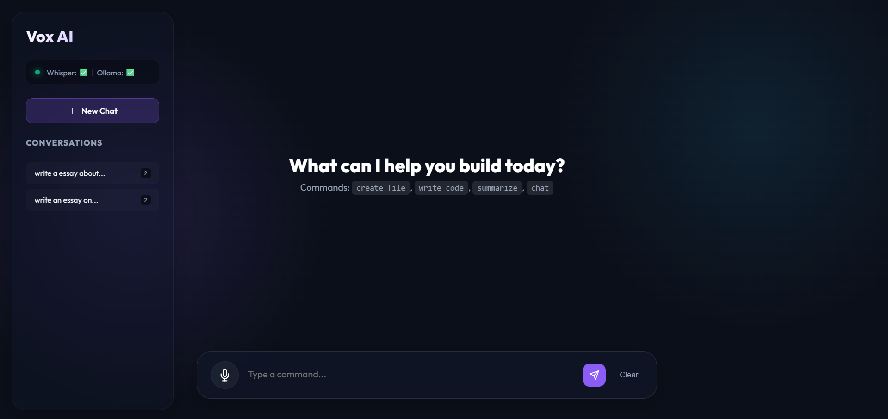

# 🎙️ Voice-Controlled AI Assistant

A fully local, voice-driven AI assistant that transcribes speech via **Whisper**, classifies intent via **Ollama**, and executes tools — all wrapped in a polished **Gradio** UI.

## 🖥️ Preview



> **Vox AI** — dark-themed interface with sidebar conversation history, 
> Whisper + Ollama status indicators, and a mic-enabled command bar.

---

## 🏗️ Architecture

```
┌──────────────────────────────────────────────────────────────┐
│                      GRADIO UI (app.py)                      │
│  ┌──────────┐  ┌──────────┐  ┌──────────┐  ┌─────────────┐  │
│  │ 🎤 Mic   │  │ 📂 File  │  │ ⌨️  Text │  │ ✅ Confirm  │  │
│  └────┬─────┘  └────┬─────┘  └─────┬────┘  │ 🚫 Cancel   │  │
│       │              │              │        └──────┬──────┘  │
│       └──────────────┴──────┬───────┘               │         │
│                             ▼                       │         │
│                    ┌────────────────┐                │         │
│                    │  stt.py        │                │         │
│                    │  (Whisper)     │                │         │
│                    └───────┬────────┘                │         │
│                            ▼                        │         │
│                    ┌────────────────┐                │         │
│                    │  intent.py     │                │         │
│                    │  (Ollama LLM)  │                │         │
│                    └───────┬────────┘                │         │
│                            ▼                        │         │
│                    ┌────────────────┐                │         │
│                    │  tools.py      │◄───────────────┘         │
│                    │  Dispatcher    │                          │
│                    └──┬──┬──┬──┬───┘                          │
│          ┌────────┐   │  │  │  │   ┌──────────┐              │
│          │create  │◄──┘  │  │  └──►│ compound │              │
│          │_file   │      │  │      │ (multi)  │              │
│          └────────┘      │  │      └──────────┘              │
│          ┌────────┐      │  │                                │
│          │write   │◄─────┘  │                                │
│          │_code   │         │                                │
│          └────────┘         │                                │
│          ┌────────┐         │       ┌────────────────┐       │
│          │summa-  │◄────────┘       │  memory.py     │       │
│          │rize    │                 │  (20-turn cap) │       │
│          └────────┘                 └────────────────┘       │
│          ┌────────┐                                          │
│          │ chat   │  (default / fallback)                    │
│          └────────┘                                          │
└──────────────────────────────────────────────────────────────┘
```

---

## 📦 Project Structure

```
voice_assistant/
├── app.py            # Gradio UI — main entry point
├── stt.py            # Speech-to-text via local Whisper
├── intent.py         # Intent classification via Ollama LLM
├── tools.py          # Tool implementations + dispatcher
├── memory.py         # Session memory (20-turn rolling)
├── requirements.txt  # Python dependencies
├── README.md         # This file
└── outputs/          # Generated files land here
```

---

## 🚀 Quick Start

### 1. Prerequisites

| Dependency | Purpose | Install |
|---|---|---|
| **Python 3.10+** | Runtime | [python.org](https://python.org) |
| **ffmpeg** | Audio decoding for Whisper | `choco install ffmpeg` (Windows) / `brew install ffmpeg` (macOS) / `apt install ffmpeg` (Linux) |
| **Ollama** | Local LLM inference | [ollama.com](https://ollama.com) |

### 2. Install Python Dependencies

```bash
cd voice_assistant
pip install -r requirements.txt
```

### 3. Start Ollama

```bash
# Pull the model (only once)
ollama pull llama3

# Start the server (if not already running)
ollama serve
```

### 4. Launch the App

```bash
python app.py
```

Open **http://localhost:7860** in your browser.

---

## 🎯 Supported Intents

| Intent | Trigger Examples | Action |
|---|---|---|
| `create_file` | "Create a file called hello.py" | Creates empty file in `outputs/` |
| `write_code` | "Write a Python function to sort a list" | Generates code via Ollama, saves to `outputs/` |
| `summarize` | "Summarize the concept of recursion" | Returns a concise summary |
| `chat` | "What's the weather like?" / anything else | Free-form conversation |
| `compound` | "Create a file and then write Python code in it" | Runs multiple intents sequentially |

---

## ⭐ Bonus Features

### 1. Compound Commands
Say something like *"Create a file called utils.py and write a Python function to merge two sorted lists"* — the system detects both intents and runs them sequentially.

### 2. Human-in-the-Loop Confirmation
File-creating and code-writing operations don't execute immediately. The UI shows the proposed action and generated code, then waits for you to click **✅ Confirm** or **🚫 Cancel**.

### 3. Graceful Degradation
- **Whisper unavailable** (no GPU / missing ffmpeg) → STT returns a helpful error; you can still type commands.
- **Ollama unreachable** → Intent defaults to `chat` with a fallback message; no crash.

### 4. Session Memory
A 20-turn rolling history is maintained in `memory.py`. The last 6 turns are injected into every Ollama prompt so the model has conversational context.

---

## ⚙️ Environment Variables

| Variable | Default | Description |
|---|---|---|
| `WHISPER_MODEL_SIZE` | `base` | Whisper model (`tiny`, `base`, `small`, `medium`, `large`) |
| `OLLAMA_BASE_URL` | `http://localhost:11434` | Ollama API endpoint |
| `OLLAMA_MODEL` | `llama3` | Ollama model name |
| `OLLAMA_TIMEOUT` | `120` | Request timeout in seconds |

---

## 💻 Hardware Notes

- **Whisper `base`** runs fine on CPU (~2 GB RAM). For real-time on longer clips, use `tiny`.
- **Whisper `large`** needs a GPU with ≥10 GB VRAM.
- **Ollama** with `llama3` (8B) needs ~6 GB RAM/VRAM. Smaller models like `phi3` or `gemma:2b` work with less.
- The Gradio server itself is lightweight (<100 MB).

---

## 🧪 Testing

```bash
# Quick smoke test — type a command instead of speaking
python app.py
# → Open browser → type "create a file called test.txt" → click Run
# → Confirm when prompted → check outputs/test.txt

# Check system status
# → Expand "⚙️ System Status" → click "🔄 Refresh Status"
```

---

## 📄 License

MIT — use freely.
